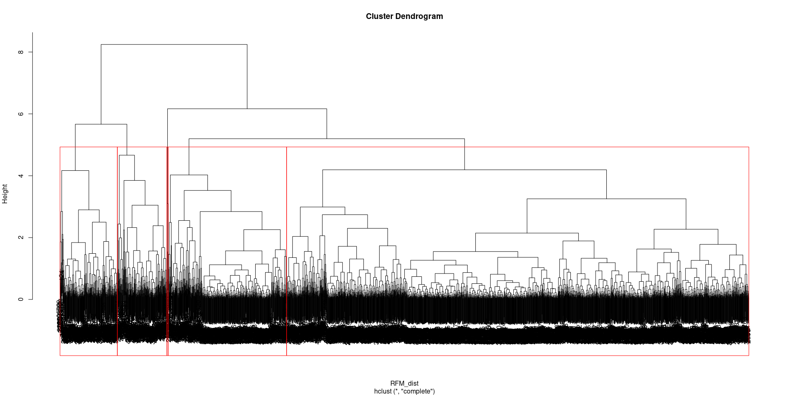
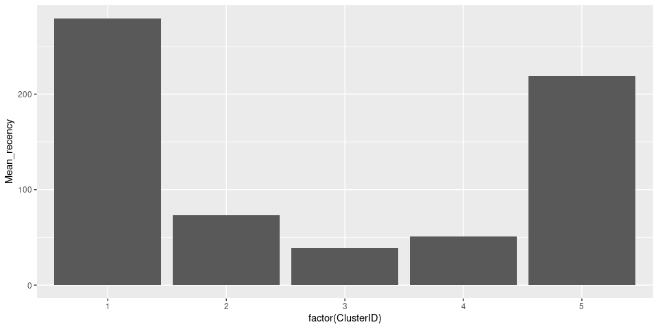
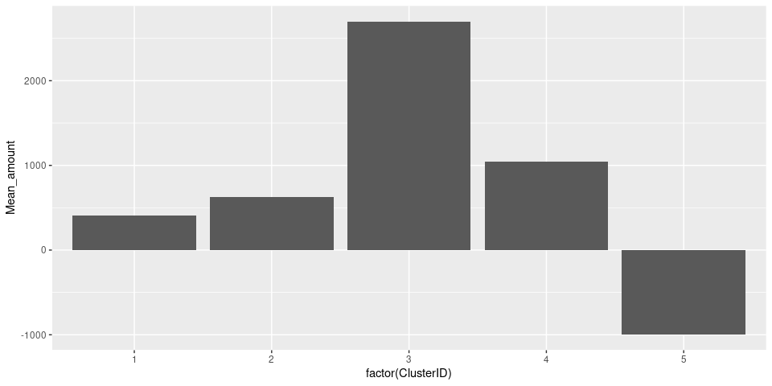

Customer Segmentation - Hierarchical
================

### **1. Importing Library**

``` r
library(dplyr)
library(ggplot2)
library(readxl)
library(knitr)
```

### **2. Importing the dataset**

``` r
Online.Retail <- read_excel("Online Retail.xlsx")
```

| InvoiceNo | StockCode | Description                         | Quantity | InvoiceDate         | UnitPrice | CustomerID | Country        |
|:----------|:----------|:------------------------------------|---------:|:--------------------|----------:|-----------:|:---------------|
| 536365    | 85123A    | WHITE HANGING HEART T-LIGHT HOLDER  |        6 | 2010-12-01 08:26:00 |      2.55 |      17850 | United Kingdom |
| 536365    | 71053     | WHITE METAL LANTERN                 |        6 | 2010-12-01 08:26:00 |      3.39 |      17850 | United Kingdom |
| 536365    | 84406B    | CREAM CUPID HEARTS COAT HANGER      |        8 | 2010-12-01 08:26:00 |      2.75 |      17850 | United Kingdom |
| 536365    | 84029G    | KNITTED UNION FLAG HOT WATER BOTTLE |        6 | 2010-12-01 08:26:00 |      3.39 |      17850 | United Kingdom |
| 536365    | 84029E    | RED WOOLLY HOTTIE WHITE HEART.      |        6 | 2010-12-01 08:26:00 |      3.39 |      17850 | United Kingdom |
| 536365    | 22752     | SET 7 BABUSHKA NESTING BOXES        |        2 | 2010-12-01 08:26:00 |      7.65 |      17850 | United Kingdom |
| 536365    | 21730     | GLASS STAR FROSTED T-LIGHT HOLDER   |        6 | 2010-12-01 08:26:00 |      4.25 |      17850 | United Kingdom |
| 536366    | 22633     | HAND WARMER UNION JACK              |        6 | 2010-12-01 08:28:00 |      1.85 |      17850 | United Kingdom |
| 536366    | 22632     | HAND WARMER RED POLKA DOT           |        6 | 2010-12-01 08:28:00 |      1.85 |      17850 | United Kingdom |
| 536367    | 84879     | ASSORTED COLOUR BIRD ORNAMENT       |       32 | 2010-12-01 08:34:00 |      1.69 |      13047 | United Kingdom |

### **3. NA value treatment**

``` r
order_wise <- na.omit(Online.Retail)
```

### **4. Making RFM data**

``` r
Amount <- order_wise$Quantity * order_wise$UnitPrice
order_wise <- cbind(order_wise,Amount)

order_wise <- order_wise[order(order_wise$CustomerID),]
monetary <- aggregate(Amount~CustomerID, order_wise, sum)

frequency <- order_wise[,c(7,1)]
k<-table(as.factor(frequency$CustomerID))
k<-data.frame(k)

colnames(k)[1]<-c("CustomerID")
master <-merge(monetary,k,by="CustomerID")

recency <- order_wise[,c(7,5)]
recency$InvoiceDate<-as.Date(recency$InvoiceDate,"%d-%m-%Y %H:%M")

maximum<-max(recency$InvoiceDate)
maximum<-maximum+1
maximum$diff <-maximum-recency$InvoiceDate
recency$diff<-maximum$diff

df<-aggregate(recency$diff,by=list(recency$CustomerID),FUN="min")
colnames(df)[1]<- "CustomerID"
colnames(df)[2]<- "Recency"

RFM <- merge(monetary, k, by = ("CustomerID"))
RFM <- merge(RFM, df, by = ("CustomerID"))
RFM$Recency <- as.numeric(RFM$Recency)
```

### **5. Outlier treatment**

``` r
box <- boxplot.stats(RFM$Amount)
out <- box$out

RFM1 <- RFM[ !RFM$Amount %in% out, ]
RFM <- RFM1

box <- boxplot.stats(RFM$Freq)
out <- box$out

RFM1 <- RFM[ !RFM$Freq %in% out, ]
RFM <- RFM1

box <- boxplot.stats(RFM$Recency)
out <- box$out

RFM1 <- RFM[ !RFM$Recency %in% out, ]
RFM <- RFM1
```

### **6. Standardization of data**

``` r
RFM_norm1<- RFM[,-1]

RFM_norm1$Amount <- scale(RFM_norm1$Amount)
RFM_norm1$Freq <- scale(RFM_norm1$Freq)
RFM_norm1$Recency <- scale(RFM_norm1$Recency)
```

### **7. Implementing Hierarchical clustering**

#### **7.1. Calculating the distance matrix**

``` r
RFM_dist<- dist(RFM_norm1)
```

#### **7.2. Constructing the dendrogram using single linkage**

``` r
RFM_hclust1<- hclust(RFM_dist, method="single")
plot(RFM_hclust1)
```

<!-- -->

#### **7.3. Constructing the dendrogram using complete linkage**

``` r
RFM_hclust2<- hclust(RFM_dist, method="complete")
plot(RFM_hclust2)

#### Visualising the cut in the dendrogram
rect.hclust(RFM_hclust2, k=5, border="red")
```

<!-- -->

#### **7.4. Making the cut in the dendrogram**

``` r
clusterCut <- cutree(RFM_hclust2, k=5)
```

#### **7.5. Appending the ClusterIDs to RFM data**

``` r
RFM_hc <-cbind(RFM,clusterCut)
colnames(RFM_hc)[5]<- "ClusterID"
```

#### **7.6. Cluster Analysis**

``` r
hc_clusters<- group_by(RFM_hc, ClusterID)
tab2<- summarise(hc_clusters, Mean_amount=mean(Amount), Mean_freq=mean(Freq), Mean_recency=mean(Recency))
```

#### **7.7. Plot**

``` r
ggplot(tab2, aes(x= factor(ClusterID), y=Mean_recency)) + geom_bar(stat = "identity")
```

<!-- -->

``` r
ggplot(tab2, aes(x= factor(ClusterID), y=Mean_amount)) + geom_bar(stat = "identity")
```

<!-- -->

``` r
ggplot(tab2, aes(x= factor(ClusterID), y=Mean_freq)) + geom_bar(stat = "identity")
```

<!-- -->
